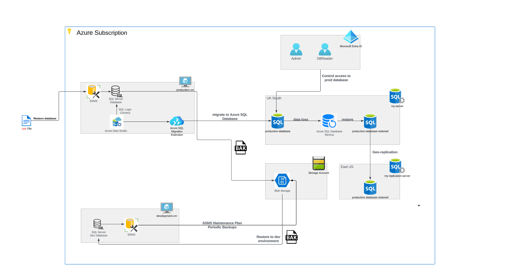

# Azure Database Migration

## Introduction

This project initiated with the creation of a cloud-based database system on Microsoft Azure, showcasing advanced cloud engineering capabilities.

The first step was building a production environment database. We then moved this database to Azure SQL Database, focusing on key practices like data backup, restoration, and automated scheduling to enhance data management.

A critical component of this project was simulating a disaster recovery scenario to tackle potential data loss, along with exploring geo-replication and failover setups to ensure data availability under various conditions. We also integrated Microsoft Entra ID for access control, adding an extra layer of security and management.

## Production Environment Setup

We started by setting up a Windows virtual machine in Microsoft Azure to mimic a Windows server. Connection to this VM was made via Microsoft Remote Desktop using the RDP protocol.

After establishing the connection, SQL Server and SQL Server Management Studio were installed on the VM for effective database management. The SQL Server database, known as AdventureWorks, was then restored from a `.bak` file, forming the production database. This included data like tables, views, and stored procedures.

## Migration to Azure SQL Database

Using the Azure portal, an Azure SQL Database was created as the target for the AdventureWorks database migration. We configured the login type to SQL login and set firewall rules for specific IP inbound connections.

Azure Data Studio was installed on the production VM to connect to the Azure SQL Database. The SQL Server Schema Compare extension helped migrate the schema from the on-premise database. Post-schema migration, the Azure SQL Migration extension was used for transferring data. We then analyzed data, schema, and configurations to ensure successful migration.

## Data Backup and Restoration

A full backup of the production database was stored in Azure blob storage, providing a secure online backup.

A secondary development environment was established for testing without affecting the production environment. In this environment, we automated weekly database backups, streamlining data recovery in case of loss or corruption.

## Disaster Recovery Simulation

To simulate data loss, critical data was intentionally removed from the Azure SQL Database. We then used Azure SQL Database Backup to restore the production database to a pre-deletion state. Post-restoration, the database was analyzed to confirm the recovery's success.

## Geo-Replication and Failover

Geo-replication for the Azure SQL Database was set up, with a synchronized replica in a different geographical region to minimize risks. We executed a planned failover to this secondary region and assessed data consistency. A failback to the primary region illustrated the failover strategy's cyclical nature.

## Microsoft Entra Directory Integration

Microsoft Entra ID authentication was activated for the Azure SQL Server, with an Entra admin overseeing user access within the Azure SQL Database. A DB Reader user account was created in Microsoft Entra ID. Using Azure Data Studio with admin credentials, the db_datareader role was assigned to this user for read-only access. We then verified the correct role assignment by accessing the database with the DB Reader's credentials.

Below is an illustration of the methods undertaken during this project:
